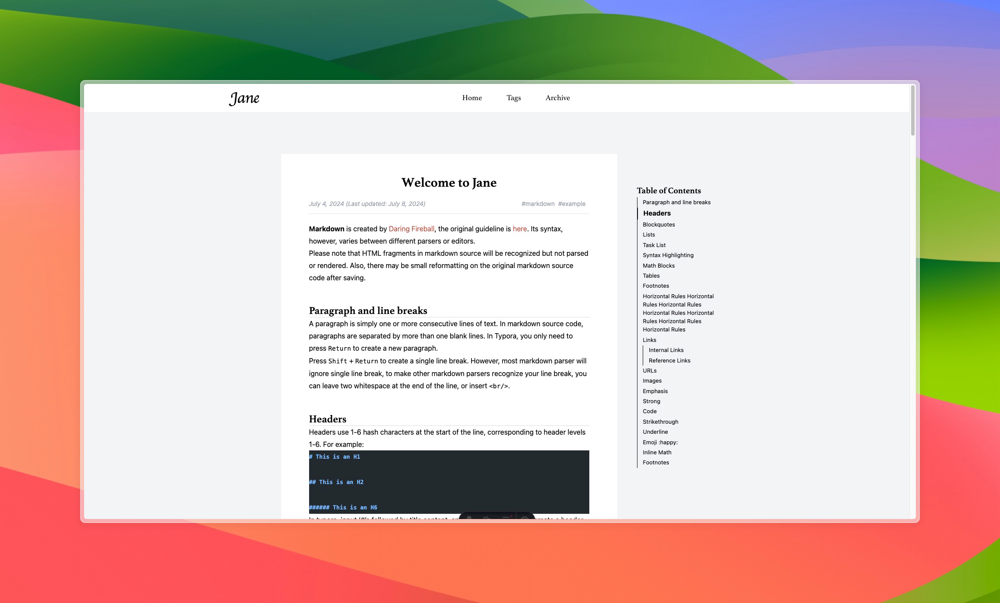

# Theme Jane for Astro



Jane is a simple, clean, and responsive theme for Astro. It's perfect for personal blogs, portfolios, and other content-focused websites.
This theme is based on the [Jane theme for Hugo](https://github.com/xianmin/hugo-theme-jane).

[Demo](https://jane-theme.lecederom.com) | [GitHub](https://github.com/CedricLphn/astrojs-theme-jane) | [Astro](https://astro.build)

## 🎒 Features
- MD and MDX support
- Tags (categories) support
- Pagination
- Table of contents

## 🚀 Project Structure

Inside of your Astro project, you'll see the following folders and files:

```text
/
├── astro.config.mjs
├── backup
│   └── posts
│       ├── first-post.md
│       ├── markdown-style-guide.md
│       ├── second-post.md
│       ├── third-post.md
│       ├── using-mdx.mdx
│       └── welcome-to-jane.md
├── markdown.config.js
├── package-lock.json
├── package.json
├── public
│   └── favicon.svg
├── src
│   ├── components
│   │   ├── Block.astro
│   │   ├── Card.astro
│   │   ├── Navigation.astro
│   │   ├── Pagination.astro
│   │   ├── Post.astro
│   │   └── TableOfContents.astro
│   ├── content
│   │   └── posts
│   │       ├── first-post.md
│   │       ├── markdown-style-guide.md
│   │       ├── second-post.md
│   │       ├── third-post.md
│   │       ├── using-mdx.mdx
│   │       └── welcome-to-jane.md
│   ├── env.d.ts
│   ├── layouts
│   │   └── Layout.astro
│   ├── pages
│   │   ├── archive
│   │   │   └── index.astro
│   │   ├── blog
│   │   │   ├── [...slug].astro
│   │   │   └── [page].astro
│   │   ├── index.astro
│   │   └── tags
│   │       ├── [...tag].astro
│   │       └── index.astro
│   └── utils
│       └── format-date.ts
├── tailwind.config.mjs
└── tsconfig.json
```

## 🧞 Commands

All commands are run from the root of the project, from a terminal:

| Command                   | Action                                           |
| :------------------------ | :----------------------------------------------- |
| `npm install`             | Installs dependencies                            |
| `npm run dev`             | Starts local dev server at `localhost:4321`      |
| `npm run build`           | Build your production site to `./dist/`          |
| `npm run preview`         | Preview your build locally, before deploying     |
| `npm run astro ...`       | Run CLI commands like `astro add`, `astro check` |
| `npm run astro -- --help` | Get help using the Astro CLI                     |

## 📚 Resources

- [Astro documentation](https://docs.astro.build)
- [Jane theme for Hugo](https://github.com/xianmin/hugo-theme-jane)